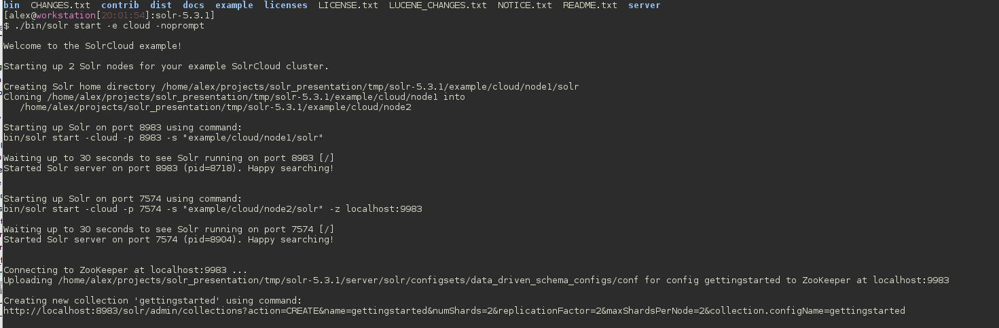
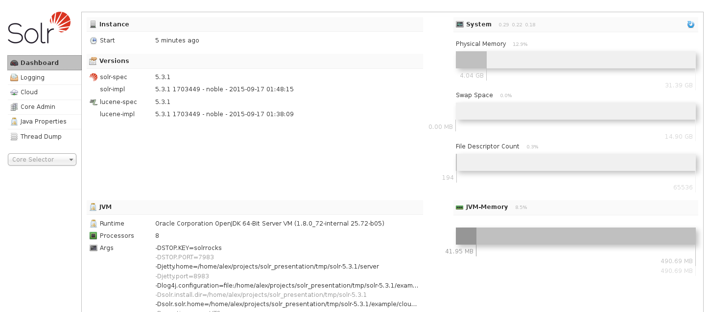

Searching documents with Apache Solr
==================

# Background

Solr makes it easy for programmers to develop sophisticated, high-performance search application.

Solr builds on another open source search technology: [Lucene](https://lucene.apache.org/core/), a java library that provides indexing and search technology, spellchecking hit highlighting and advanced analysis/tokenization capabilities.

Another technology has been incorporated into Solr -- Apache Tika.
The [Apache Tika](https://tika.apache.org/) toolkit detects and extracts metadata and text from over a thousand different file types such as PPT, XLS and PDF.

# Why Solr?

I worked on a project that's been using Mezzanine CMS and it's built-in search was not great -- basically wide SQL queries on the database.
So I looked for something that does search better, and especially searches through Word and PDF documents.

Django Haystack is a universal search frontend for Django. Although some work was still needed to replace built-in search in Mezzanine.

Django Haystack has the following alternative backends:

Elastic search -- also built on Lucene, but more about big data than general-purpose searching.

Whoosh -- Indexing and search library implemented in python, but provides no document extraction

Xapian -- A C++ search engine library with bindings in every language including python

Although no alternative search backend provides document extraction support, in the end this wasn't as critical as it is possible to extract document content with Apache Tika, and then pass it to any indexing and searching backend.

# How solr interacts with python?

Solr is built as a web service, running on  [Jetty](http://www.eclipse.org/jetty/) web server, usually on port 8983, exposing XMLRPC interface for other applications.

Good news, you wouldn't have to deal with XML RPC because there's already pysolr that does it for you.

[PySolr PyPi](https://pypi.python.org/pypi/pysolr/3.3.3)
[PySolr Github](https://github.com/toastdriven/pysolr)

Django Haystack uses pySolr as a way of communicating with Solr.

# Quickstart

See solr_test.py for code example.

Here I'm going to start up solar with the default configuration, connect to it using pysolr, then extract file content using built in Apache Tika.

### Solr default setup

Downloading, extracting and starting solr

    $ wget http://apache.mirror.vexxhost.com/lucene/solr/5.3.1/solr-5.3.1.tgz
    $ tar xzf solr-5.3.1.tgz
    $ cd solr-5.3.1
    $ ./bin/solr start -e cloud -noprompt

When solr starts up successfully something like the following will show up.

Navigate with a browser to solr port, the page will show all kinds of stats.

### Using PySolr

Installing PySolr

    $ pip install pysolr

Connecting to solr

    import pysolr

    solr = pysolr.Solr(
        'http://localhost:8983/solr/gettingstarted_shard1_replica1',
        timeout=10
    )

Indexing documents, first create a file handle to a document, then pass it to solr.

    with open('testfile.doc', 'rb') as fh:
        data = solr.extract(fh)

If you don't want to associate data with that particular filename, or some preprocessing is needed before inserting the data into the index, it is possible to opt out of direct indexing the file and just extracting the data.

    with open('testfile.doc', 'rb') as fh:
        # only extract data
        data = solr.extract(fh, extract_only=True)
        content = extract_content(data['contents'])

        #prepare index

        index = [{
            'id': 'that_word_document',
            'title': content,
        }]

        solr.add(index)

Searching:

    results = solr.search('indexed token')

Deleting single index:

    solr.delete=(id='that_word_document')

Clearing index

    solr.delete=(q='*:*')

